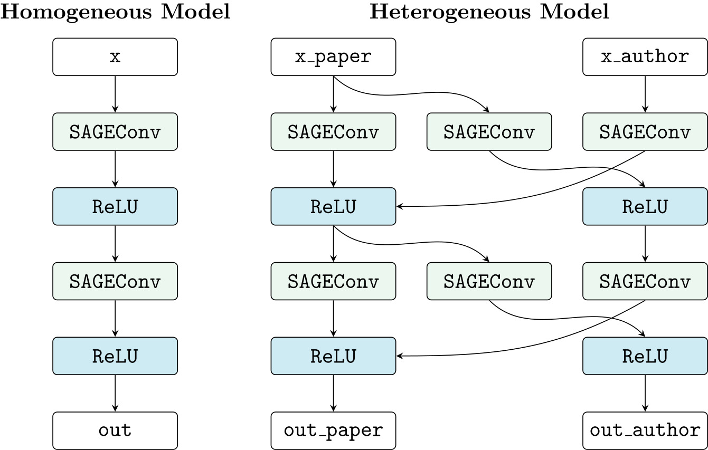

# Book Recommendation System
## Introduction
## Dataset
## Model architecture

#### *The model pattern of two types of graph* (Cre: [pytorch-geometric heterogeneous](https://pytorch-geometric.readthedocs.io/en/latest/tutorial/heterogeneous.html))
## Train
## Result