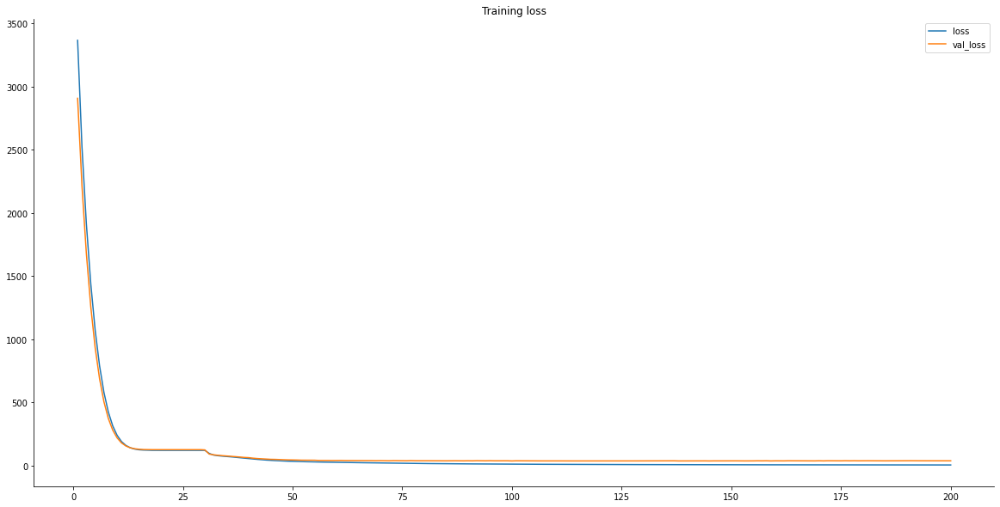

# Traffic forecasting

> Disclaimer: In this project, I'm research and re-implement follow in the article [Predicting Los Angeles Traffic with Graph Neural Networks - Amelia Woodward](https://medium.com/stanford-cs224w/predicting-los-angeles-traffic-with-graph-neural-networks-52652bc643b1)

## Dataset
Following the original paper, I use the [PeMSD7](/data/raw/), the sub-dataset extracted from the PeMS dataset. The dataset includes 228 sensors scattered throughout California. Data is placed in two files [PeMSD7_V_228.csv](./data/raw/PeMSD7_V_228.csv) and [PeMSD7_W_229.csv](./data/raw/PeMSD7_W_228.csv). I'll denote PeMSD7_V_228 as *V* and PeMSD7_W_228 as *W*. The V set contains the velocity observed from 1st May - 31st June. The W set is the adjacency matrix that represents the link between nodes. Its value is the distance between two arbitrary nodes. So, the dataset have totally 44 days and the number of record is 12,672 (*rows*).

## Processing data
In the first phase, I will use the Speed2Vec method which is introduced in Spatial-Temporal Graph Attention Network. The method is used to make the data contain richer information than just using the mean value at each node. The common method is to get the mean or just one velocity value. Speed2Vec adds more historical data into feature vectors to make them rich information. I denote ***F = 12*** as the window size and ***H = 9*** as the length of time step needs to be predicted. With the W set, we can extract the edge list and edge label. The dataset contains a total of 1,892 edges

> Figure 1. The visualization of Speed2Vec method

## Model
### Model architecture
I use the original model from the article, the model is hybrid which has 3 blocks (*The article and paper only write 2, but I want to make the architecture clear so I use 3 blocks*). The architecture:

    + The GNN block: This block is built based on the GAT layer for extracting spatial feature
    + The RNN block: Using the LSTM layer for extracting temporal feature
    + The MLP block: After extracting spatial-temporal features in the two blocks above, this block is used to make the predictions.

> Figure 2. ST-GAT model architecture

## Experiment
### Hyper-parameters
`BATCH_SIZE`: 50

`Learning rate`: 0.003

`EPOCH`: 200
#### Result
Total training time: ***4 mins 25 seconds***

The result:
| metric | Value |
|--------|-------|
| Loss   | 5.08  |
| Mae    | 1.4   |

After the training model, the result of my implementation is nearly the value of the article above and sometimes better than it. I plot the training loss diagram which shows the loss decreases smoothly over epochs. Besides that, we plot the ground truth and the prediction on the same diagram to compare. Easily recognize the prediction value is nearly the ground truth.

> Figure 3. Training loss

> Figure 3. Training loss

